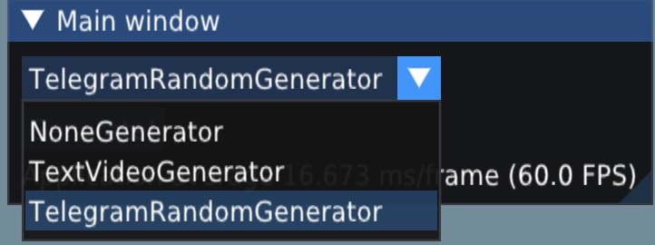
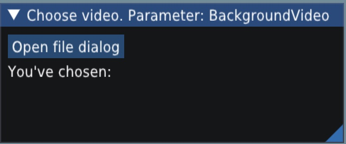
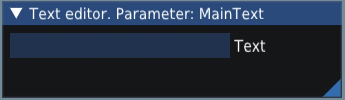
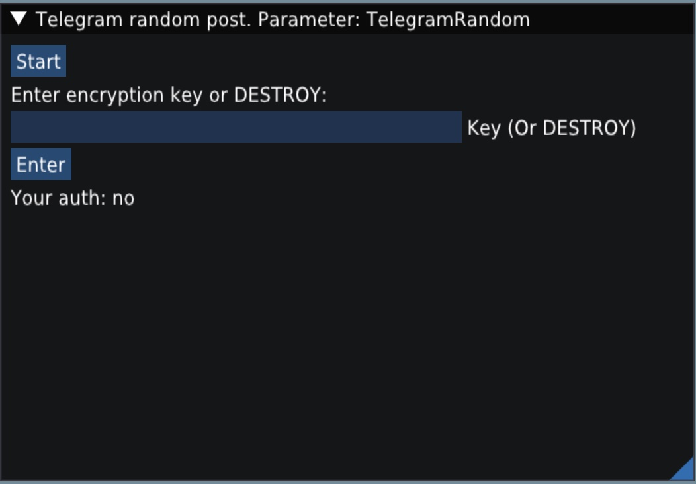
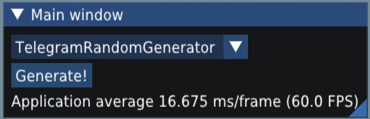
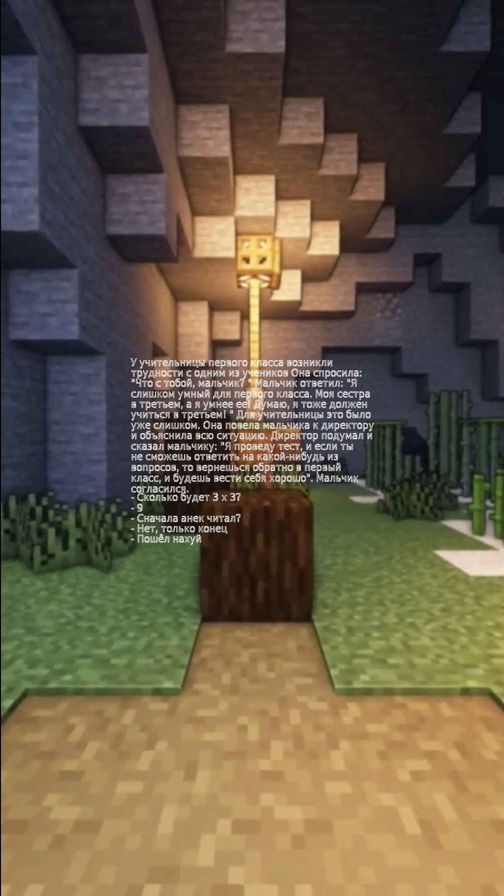

# TiktokGen
C++ ImGUI Application that can generate videos for tiktok. However, can't upload them.

You can modify sources to add your own generator algorithm. 

## Warning
This application is not finished and probably won't be finished.
I was coding it to understand how C++ works with external libraries.
 You can use the code for your projects freely.

Also, it was coded on Mac and not tested on other platforms or devices :/

## How to use it
### Step 1
Choose generator type

### Step 2
Enter data which is required for your generator type. 
It can be:
1) Background video:  

2) Raw text:  

3) Telegram API post grabber:  

### Step 3
Click "generate" button.

After application freeze
(everything is done on UI thread) your video will be saved on disk near your binary.

## Telegram random generator
Currently, there is only one generator supported:
1) Take random telegram post.
2) Choose background video from your disk.
3) Choose background audio from your disk. 
4) App combines these data and generates video for you. Example below:

Example

## Missing libs in repo
In directory "Modules" there should be compiled libs of
OpenCV (with extra) and tdlib. You can check cmake 
to understand how they were used.

## TODO (there is much to do actually):
1) Upload generate videos into TikTok. TikTok supports some kind of API, but
you need to be verified to use it. You can use some virtual browser like
https://github.com/makiisthenes/TiktokAutoUploader does.
2) Support more formats. Currently, only .mp4 for video and .aac for video are supported.
3) Fix a lot of bugs. Telegram API is not tested. Also,
there can be bugs with FFMPEG related code (like combining audio and video)